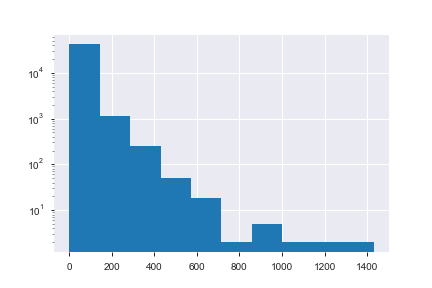

# webcrawltakehome

1,000,000 rows, 13,670 Nan values in hostnameHash. 

Followup for later, why can't these be parsed?

For now we will drop the NaN hostnameHash leaving us with 986,330 rows.

Suppose you want to understand more about these hosts and their dependent requests.  What can you derive from this data?  

Some ideas:

* what does the distribution of dependent requests across hosts look like?  What other basic statistics might be interesting to describe this data?
<<<<<<< HEAD

=======

>>>>>>> 65173e513a7fc9917c6233f33403c12166e4e2e0
Heavily skewed with a very long tail. 
In fact, looking at the summary statistics below, we can see 1/4 have 1 request, half have less than 5 and 3/4 have less than 18 request, while the last quartile slowly rockets up to 1430 requests!

* can you classify hosts into reasonable "types" based on these features?  Conceivably, www.google.com will look different from www.nytimes.com, but perhaps www.google.com and www.bing.com are similar?

Yes, the types could be derived by classifying based on number of dependent and requests and the content type of the requests.

One can one-hot-encode or make dummy variables for the contentType and use those values to classify the parentPageRequests.

* are there interesting correlations between dependent requests?

There certainly seems to be likely, I was not able to distill any concretely in the time alotted.

* any other interesting question you might want to answer...

Why are there NaN values for hostnameHash and why are there NaN for contentType?

